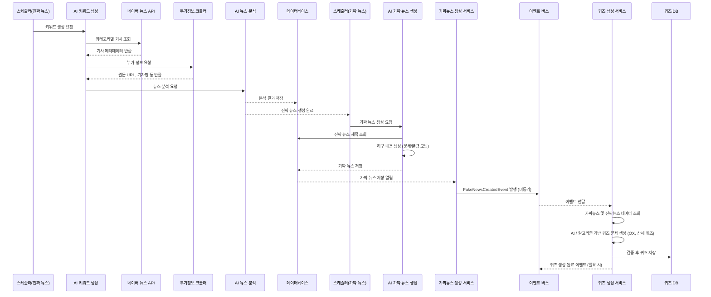
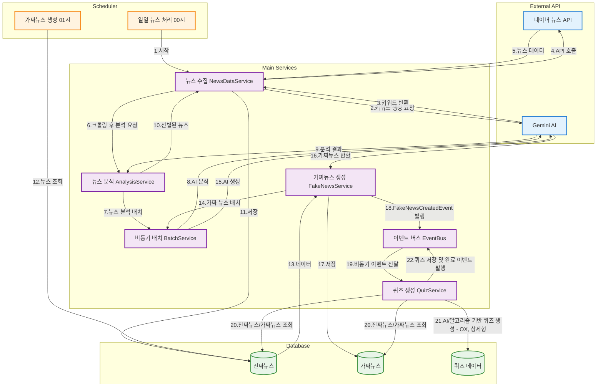

# 📰 뉴스 생성 시스템

## 📌 개요
본 시스템은 사용자가 뉴스의 진위 여부를 판별하거나 뉴스 관련 퀴즈를 풀며 미디어 리터러시(정보 판별력)를 기를 수 있는 웹 서비스입니다.
뉴스에 대한 관심이 낮은 젋은 세대를 주요 타겟으로 삼아, 단순한 정보 제공을 넘어 게임처럼 재미있게 뉴스를 접하고 학습하도록 유도합니다.
또한 RPG 캐릭터 요소를 더해 사용자가 꾸준히 참여하도록 설계했습니다.
스케줄러, AI, 크롤링, 외부 API 연동, 그리고 보안 관리(Spring Security) 등을 통합해 운영하며,  
뉴스 콘텐츠 기반 퀴즈를 생성해 사용자 참여도를 높이는 것을 목표로 합니다.  

---

## 👥 팀원 및 역할

| 팀원 | 역할 | 담당 업무 |
|------|------|-----------|
| 이예진(팀장) | Backend / Frontend | 인증/인가, 소셜로그인 |
| 김성철(PM) | Backend / Frontend | 프로젝트 관리, 회원 도메인, 퀴즈 이력 |
| 김율희 | Backend | 퀴즈 도메인 전반, AI 호출 관리 담당 |
| 최승욱 | Backend | 뉴스 도메인 전반, 뉴스 생성 및 데이터 수집·전처리 담당 |

*각 팀원은 맡은 영역에서 협업하며, 전체 시스템 안정성과 기능 확장을 위해 소통하고 있습니다.*

---

## 🛠 기술 스택
- **Backend**: Java 23, Spring Boot 3.x
- **Database**: MySQL 8.x / JPA
- **AI 연동**: Google Gemini API
- **크롤링**: Jsoup
- **외부 API**: 네이버 뉴스 API
- **Scheduler**: Spring @Scheduled
- **비동기 처리**: CompletableFuture, ThreadPoolTaskExecutor

---

## 1️⃣ 진짜 뉴스 생성 과정

1. **스케줄러 트리거**
   - 매일 정해진 시각에 스케줄러가 진짜 뉴스 생성 작업 시작

2. **AI 프롬프트 호출 및 키워드 생성**
   - AI가 `KeywordHistory` 테이블을 참조하여 **정치, 경제, IT, 사회, 문화** 5개 카테고리별 키워드 2개씩 선별
   - 웹 사전 조사 (주요 헤드라인, 예정 발표, 최근 이슈 등)
   - 최근 사용 키워드 제외
   - `KeywordType`(Enum) 기반으로 진행 중이거나 속보성 기사 포함

3. **네이버 API 호출**
   - 각 키워드별로 N건의 기사를 조회
   - 기사 **제목, 요약** 등 메타데이터 수집

4. **부가 정보 크롤링**
   - 원문 URL, 기자명 등 추가 정보 크롤링

5. **AI 뉴스 분석**
   - 비동기 Batch로 AI 뉴스 분석 프로세서 호출
   - 각 뉴스별 카테고리 분류 및 **완성도, 명확성** 등 기준에 따라 점수 부여

6. **최종 뉴스 선정**
   - 카테고리별 상위 N개 뉴스 필터링
   - 5개 카테고리 중 랜덤으로 최고 점수 뉴스 1건을 **오늘의 뉴스**로 선정

---

## 2️⃣ 가짜 뉴스 생성 과정

1. **스케줄러 트리거**
   - 진짜 뉴스 생성 완료 후, 스케줄러가 가짜 뉴스 생성 작업 시작

2. **가짜 뉴스 AI 생성**
   - 비동기 Batch로 AI 생성 프로세서 호출
   - 진짜 뉴스의 **제목**을 기반으로 허구의 내용 창작
   - 원문 문체, 분량 등을 모방

3. **저장 및 퀴즈 생성**
   - 생성 성공 시 DB에 저장
   - 관련 퀴즈(OX형)와 함께 서비스

---

## 3️⃣ 퀴즈 생성 과정

1. **뉴스 저장 이벤트 수신**  
   - 진짜 뉴스/가짜 뉴스/오늘의 뉴스가 DB에 저장되면, 저장 완료 이벤트가 발행되어 각 이벤트 리스너에서 퀴즈 생성 로직 호출

2. **퀴즈 출제 데이터 준비**  
   - 이벤트로 전달된 뉴스 ID 리스트를 통해 해당 뉴스 내용 조회   

3. **퀴즈 문제 자동 생성**  
   - **상세 퀴즈**: AI 호출을 통해 각 뉴스 내용을 기반으로 뉴스 이해도를 평가하는 객관식 문제를 뉴스 당 3개씩 생성 (원활한 생성을 위해 비동기 처리, Rate Limit 적용)
   - **팩트 퀴즈(OX 퀴즈)**: 진짜 뉴스와 그에 대응되는 가짜 뉴스를 연결해 어떤 뉴스가 진짜/가짜인지 판별하는 문제 생성
   - **오늘의 퀴즈**: 오늘의 뉴스에 해당하는 상세 퀴즈를 오늘의 퀴즈로 등록

4. **퀴즈 저장 및 서비스 연동**  
   - 생성된 퀴즈는 DB에 저장되어 사용자에게 제공됨  
- 퀴즈 서비스와 연동되어 앱 내 퀴즈 콘텐츠로 노출

## 3️⃣ 시퀀스 다이어그램

## 3️⃣ 아키텍처 다이어그램

---

📂 디렉토리 구조
```plaintext
src
└── main
    └── java
        ├── domain               # 도메인별 핵심 비즈니스 로직
        │   ├── member           # 회원 관련
        │   │   ├── member
        │   │   └── quizhistory
        │   ├── news             # 뉴스 관련
        │   │   ├── common
        │   │   ├── fake
        │   │   ├── real
        │   │   └── today
        │   └── quiz             # 퀴즈 관련
        │       ├── daily
        │       ├── detail
        │       └── fact
        └── global               # 전역 모듈
            ├── ai              # AI 연동 모듈
            ├── exception       # 예외 처리
            ├── init            # 초기 설정
            ├── security        # 보안 설정
            ├── util            # 유틸리티
            └── etc             # 기타 공용 모듈
```
